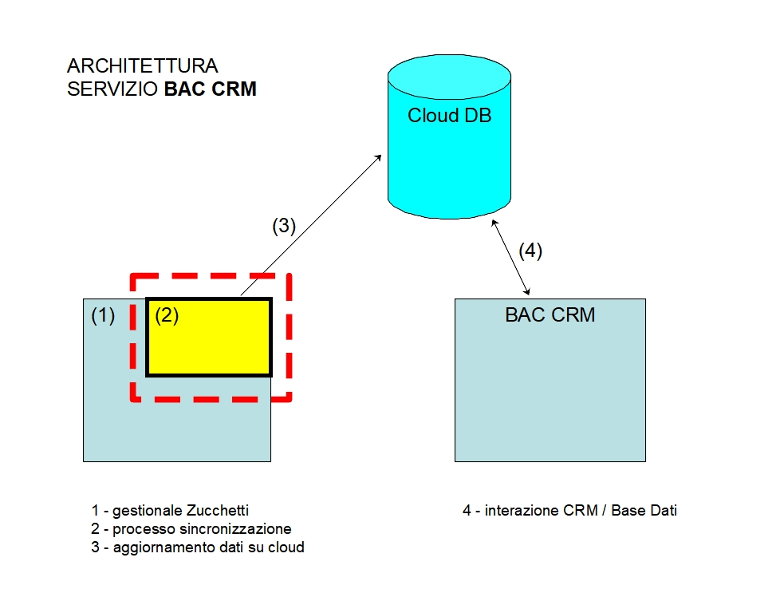

# BAC GESTIONALE INTERFACE

## CARICAMENTO DATI

`node start-monitor-gestionale` using default `env.json` config file or `node start-monitor-gestionale -c <CONFIG_FILE>` with a 
specific config file.



### CONFIG FILE

Example [env_template.json](./env_template.json)
```json
{
    "MONGO_URL": "<VALUE MONGO URL>",
    "DB_NAME": "<VALUE DB NAME>",
    "SYNC_FREQUENCY": 60,
    "DBF_DIR_PATH": "<PATH DIR DBF FILES>"
}
```
If no file is specified with `-c` option, default `./env.json` is used.

| Param| Desc| Default |
|---|---|---|
| _MONGO_URL_   |  Url mongo db server | **NONE** |
| _DB_NAME_ | mongo db instance name | **NONE** |
| _SYNC_FREQUENCY_ | seconds frequency for check synchronization | **NONE** |
| _DBF_DIR_PATH_ | path dir `.DBF` files | '_./data_' |

### CLEAN CACHE

`node tools/clean-cache.js -d ANAGRAFICA -p ./cache_db/gestionale-db-test`


